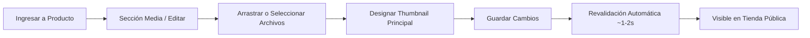
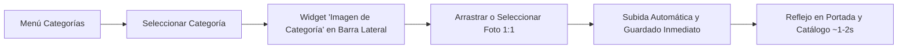

# Runbook Oficial: Gestión de Imágenes de Catálogo en Medusa Admin

**Audiencia:** Equipo de Marketing, Catálogo y Contenido Comercial — Control Nautas  
**Versión del documento:** 1.0  
**Fecha de vigencia:** Septiembre 2026  
**Entorno de gestión:** [Panel Medusa Admin (https://controlnautas.com/app)](https://controlnautas.com/app)  
**Tienda pública:** [controlnautas.com](https://controlnautas.com)

---

## 1. Introducción y Propósito

Este runbook describe el procedimiento operativo estándar para la gestión integral de imágenes de productos (fotografía de producto, diagramas técnicos y miniaturas) en el catálogo de **Control Nautas**.

El panel de administración de **Medusa Admin** es la **única fuente de verdad** comercial para el catálogo. Toda imagen cargada y configurada a través de este panel se sincroniza y publica directamente en la tienda pública de forma automatizada, garantizando una experiencia visual consistente, profesional y de alta velocidad para nuestros clientes B2B.

---

## 2. Acceso al Panel de Administración (Medusa Admin)

1. **URL de ingreso:** Accede desde cualquier navegador web moderno a:  
   👉 **`https://controlnautas.com/app`**
2. **Autenticación:** Ingresa tu correo electrónico corporativo y contraseña asignada por el equipo de sistemas.
3. **Inicio de sesión:** Al ingresar con éxito, serás redirigido a la vista general del panel de control de Medusa.

> [!NOTE]  
> Si no cuentas con credenciales de acceso o presentas problemas de autenticación, contacta al administrador del sistema para la creación o restablecimiento de tu usuario con perfil de catálogo/marketing.

---

## 3. Navegación hacia la Sección 'Media' del Producto

Para editar la galería visual de cualquier producto del catálogo, sigue estos pasos:

1. **Abrir el catálogo:** En el menú lateral izquierdo, haz clic en **Productos** (*Products*).
2. **Localizar el producto deseado:**
   - Utiliza la barra de búsqueda en la parte superior del listado para buscar por **nombre del producto**, **modelo** o **código/SKU**.
   - También puedes aplicar filtros por estado (*Publicado*, *Borrador*), categoría o colección.
3. **Seleccionar el producto:** Haz clic sobre el nombre del producto para ingresar a su ficha técnica completa.
4. **Ubicar la sección 'Media':**
   - Desplázate hacia abajo en la ficha del producto hasta encontrar la tarjeta o bloque titulado **Media** (Galería de imágenes).
   - En esta sección visualizarás las imágenes actuales del producto, la miniatura destacada y la opción para agregar o editar material multimedia.

---

## 4. Especificaciones Fotográficas y Estándar de Calidad

Para proyectar una imagen industrial premium y asegurar la máxima velocidad de carga en la tienda, todas las imágenes deben cumplir con los siguientes lineamientos antes de subirse:

### 4.1 Requisitos Técnicos y Visuales

| Parámetro | Especificación Recomendada | Justificación / Impacto |
| :--- | :--- | :--- |
| **Dimensiones** | **1000 × 1000 píxeles** (relación 1:1 cuadrada) | Garantiza nitidez en zoom y uniformidad en la cuadrícula de productos. |
| **Fondo** | **Blanco puro (`#FFFFFF`)** | Integración transparente y limpia con el fondo de la tienda web. |
| **Encuadre** | **Centrado (80% – 85% del lienzo)** | El producto debe respirar dejando un margen uniforme alrededor, sin cortes en bordes. |
| **Iluminación** | **Luz difusa y pareja** | Evitar sombras duras, reflejos metálicos distorsionados o zonas sobreexpuestas. |
| **Marcas de agua** | **Prohibidas** | No incluir marcas de agua, logotipos sobrepuestos, bordes decorativos ni sellos promocionales. |
| **Peso del archivo** | **Menor a 500 KB** (máximo tolerable: 2 MB) | Optimiza el rendimiento móvil y el tiempo de carga de página. |

### 4.2 Formatos de Archivo Admitidos

1. **WebP (`.webp`) — FORMATO PREFERIDO Y RECOMENDADO:**
   - Ofrece la mejor relación calidad/compresión del mercado web actual.
   - Reduce el consumo de datos de los clientes y maximiza el puntaje SEO (Google Core Web Vitals).
2. **JPG / JPEG (`.jpg`, `.jpeg`) — ACEPTABLE:**
   - Adecuado para fotografías de alta definición cuando la exportación a WebP no esté disponible en el flujo de diseño.
3. **PNG (`.png`) — USO LIMITADO:**
   - Permitido únicamente con fondo blanco plano renderizado.
   - *Evitar transparencias alfa:* En productos industriales con fondos transparentes pueden generarse artefactos visuales o contrastes no deseados.

---

## 5. Nomenclatura de Archivos y Prevención de Retención de Caché

### 5.1 Regla de Oro: Nombres Únicos y Descriptivos

Tanto los navegadores de los clientes como los servidores intermedios de red almacenan en caché las imágenes para acelerar visitas recurrentes. Si reemplazas una imagen subiendo un archivo con exactamente el mismo nombre (por ejemplo, `foto.jpg` o `producto.png`), **el navegador del cliente continuará mostrando la versión antigua** durante días o semanas.

### 5.2 Estructura de Nombre Recomendada

Utiliza siempre nombres en minúsculas, separados por guiones medios (`-`), describiendo modelo, fabricante y ángulo o perspectiva:

```text
[modelo]-[marca-o-fabricante]-[perspectiva-o-variante].[extension]
```

**Ejemplos correctos:**
- ✅ `valvula-esfera-2pulg-controlnautas-frontal.webp`
- ✅ `panel-lana-roca-alta-densidad-perspectiva.webp`
- ✅ `manta-fibra-ceramica-1260-detalle-malla.webp`
- ✅ `manometro-glicerina-0-100psi-caratula-v2.webp`

**Ejemplos a evitar:**
- ❌ `IMG_20260904_123456.jpg` (No aporta información ni valor SEO).
- ❌ `foto producto final (1).png` (Contiene espacios y paréntesis).
- ❌ `válvula_diseño#1.webp` (Contiene acentos, eñes y caracteres especiales).
- ❌ `foto.webp` (Genérico, propensa a colisiones y problemas de caché).

> [!TIP]  
> Si estás reemplazando la foto de un producto ya publicado para corregir un detalle visual, añade un sufijo de versión o fecha (por ejemplo: `...-frontal-v2.webp` o `...-frontal-2026.webp`). Esto forzará una descarga fresca en todos los navegadores de forma instantánea.

---

## 6. Procedimiento Paso a Paso: Subida y Reordenamiento

Sigue este flujo de trabajo para cargar o actualizar las imágenes de un producto:



### Paso 1: Abrir la Edición de 'Media'
- En la sección **Media** del producto, haz clic en el menú contextual de opciones (tres puntos `...`) o en el botón **Editar / Edit media**.

### Paso 2: Subir los Archivos de Imagen
- **Opción A (Arrastrar y soltar):** Selecciona las imágenes preparadas desde la carpeta de tu computadora y arrástralas directamente dentro del área delimitada con líneas punteadas (*Drop images here*).
- **Opción B (Explorador de archivos):** Haz clic sobre el área de carga para abrir el explorador de archivos de tu sistema operativo y selecciona los archivos deseados.
- Espera unos instantes mientras el indicador de carga procesa la subida de los archivos.

### Paso 3: Asignar la Imagen Principal (Thumbnail)
- La **Miniatura (Thumbnail)** es la imagen principal que aparecerá en los resultados de búsqueda, listados de categorías, carritos de compra y como portada inicial de la ficha técnica.
- Para marcarla:
  - En la lista de imágenes cargadas, ubica la fotografía frontal o más representativa del producto.
  - Selecciona la opción **Marcar como miniatura** (*Make thumbnail* o el icono de selector/estrella según la versión del panel).
  - Puedes reordenar la posición relativa de las imágenes restantes arrastrándolas para definir el orden en que los clientes navegarán la galería secundaria en la tienda.

### Paso 4: Guardar y Publicar
- Haz clic en el botón **Guardar y cerrar** (*Save and close*) o **Guardar cambios** (*Save changes*).
- El panel confirmará con un aviso de éxito en verde indicando que el producto ha sido actualizado satisfactoriamente.

---

## 7. Gestión de Imágenes de Categorías en Medusa Admin

A diferencia de los productos (que disponen de una galería multimedia en el cuerpo principal), las **Categorías y Subcategorías** cuentan con un widget dedicado en la barra lateral derecha para gestionar su imagen representativa.



### 7.1 Dónde se Muestran las Imágenes de Categoría en la Tienda
1. **Portada Principal (Home):** En la cuadrícula de familias industriales destacadas (los cuadros superiores de navegación con conteo de productos).
2. **Hubs de Familias L1:** En las páginas de navegación de macro-familias (ej. `/pe/store/calefaccion-electrica` o `/pe/store/sensores-transmisores`).
3. **Pestañas y Chips L2:** En los carruseles de selección rápida de subcategorías dentro de los listados de productos.
4. **Cabecera de Ficha Técnica:** En la parte superior de las tablas comparativas y metadatos para buscadores (SEO / OpenGraph).

### 7.2 Procedimiento Paso a Paso para Cambiar la Imagen de una Categoría

1. **Ingresar a Categorías:** En el menú lateral izquierdo de [Medusa Admin](https://controlnautas.com/app), haz clic en **Categorías** (*Categories*).
2. **Seleccionar la Categoría o Subcategoría:**
   - Haz clic sobre el nombre de la categoría que deseas modificar (ej. **Control e Indicación**).
3. **Ubicar el Widget 'Imagen de Categoría':**
   - En la columna lateral derecha (arriba de la sección *Organizar*), verás la tarjeta titulada **Imagen de Categoría**.
   - Verás la previsualización cuadrada actual de la imagen y un distintivo (*badge*):
     - 🟢 **Imagen oficial Medusa:** La categoría ya cuenta con una fotografía personalizada guardada en la base de datos.
     - 🟠 **Imagen por defecto (sistema):** La categoría está utilizando la imagen histórica o de respaldo del sistema.
4. **Subir la Nueva Imagen:**
   - **Arrastrar y soltar:** Arrastra el archivo preparado directamente sobre el recuadro gris punteado.
   - **O hacer clic:** Pulsa el botón **"Seleccionar archivo"** y elige la imagen desde tu computadora.
   - *Formatos admitidos:* WebP (recomendado), JPG, PNG o SVG, peso máx. 2 MB, encuadre cuadrado 1:1.
5. **Guardado Automático y Notificación:**
   - En cuanto seleccionas el archivo, el sistema lo sube automáticamente a `/static/...` y asocia la URL a la categoría.
   - Aparecerá un aviso verde en la esquina superior: *"Imagen de categoría actualizada"*.
   - La vista previa se actualizará al instante reflejando la nueva fotografía con el badge verde **"Imagen oficial Medusa"**.

### 7.3 Funciones Adicionales del Widget

* **Editar URL manualmente:** Si dispones de una ruta interna existente (ej. `/cn-media/categories/nombre.webp`) o una URL externa, haz clic en *"Editar URL manualmente"*, ingresa el enlace y pulsa *"Guardar URL"*.
* **Eliminar imagen:** Si necesitas remover la imagen personalizada para que la categoría vuelva a la imagen estándar del sistema, haz clic en el botón rojo con ícono de papelera **"Eliminar imagen"**. El sistema desvinculará la URL y restaurará el estado por defecto.

---

## 8. Tiempo de Reflejo en la Tienda Pública

Control Nautas implementa un sistema de **revalidación automática bajo demanda** (On-Demand Cache Revalidation) con Next.js:

1. **Reflejo casi instantáneo:** En un plazo habitual de **1 a 2 segundos** tras presionar *Guardar*, el backend emite una señal de revalidación que actualiza la página del producto en la tienda pública.
2. **Verificación en tienda:**
   - Abre una nueva pestaña y navega a la URL pública del producto:  
     `https://controlnautas.com/productos/[handle-del-producto]`
   - Comprueba que la nueva imagen y miniatura se muestran con nitidez y en las posiciones configuradas.
3. **Si el navegador local no actualiza la vista:**
   - Debido a la caché local de tu propio equipo, si habías visitado el producto segundos antes, tu navegador puede estar sirviendo la imagen local guardada en disco.
   - Aplica un refresco forzado con omisión de caché:
     - En **Windows / Linux:** Presiona `Ctrl + F5` o `Ctrl + Shift + R`.
     - En **Mac:** Presiona `Cmd + Shift + R`.
     - Alternativa: Abre el enlace en una ventana de incógnito o navegación privada.

---

## 9. Preguntas Frecuentes (FAQ) y Resolución de Problemas

### P1: La imagen cargada se visualiza en Medusa Admin, pero en la tienda pública se ve un cuadro gris o el ícono de imagen rota.
* **Causa probable:** El archivo contenía caracteres especiales no permitidos en la URL (espacios, tildes, símbolos `#`, `&`) o la revalidación tardó unos segundos adicionales.
* **Solución:**
  1. Renombra el archivo en tu computadora utilizando únicamente letras minúsculas, números y guiones (ej. `panel-aislante-tipo-a.webp`).
  2. Vuelve a subir el archivo en la sección Media y guarda los cambios.
  3. Espera 5 segundos y recarga la página del producto con `Ctrl + F5`.

### P2: Al intentar subir la imagen, Medusa Admin muestra una alerta roja de error.
* **Causa probable:**
  - El archivo supera el tamaño máximo permitido (> 5 MB).
  - El archivo tiene un formato no admitido (por ejemplo: `.tiff`, `.bmp`, `.heic`, `.pdf`).
  - Pérdida temporal de conexión con el servidor.
* **Solución:**
  1. Comprueba las propiedades del archivo y asegúrate de que pese menos de 2 MB y esté en formato `.webp`, `.jpg` o `.png`.
  2. Verifica tu conexión a internet y refresca el panel Admin (`F5`).
  3. Si el problema persiste tras validar formato y peso, captura una pantalla del mensaje de error y repórtalo al equipo técnico.

### P3: ¿Cuántas imágenes es recomendable subir por producto?
* **Recomendación:** Entre **2 y 5 imágenes** por producto:
  1. **Foto 1 (Thumbnail):** Vista frontal completa o isométrica 3/4 sobre fondo blanco.
  2. **Foto 2:** Vista lateral o trasera mostrando puertos, conexiones o especificaciones de anclaje.
  3. **Foto 3:** Detalle en primer plano de placas de características, texturas o materiales.
  4. **Foto 4 (Opcional):** Diagrama técnico de dimensiones o esquema de aplicación.

### P4: Subí una imagen nueva, pero sigue apareciendo la versión anterior incluso tras esperar y refrescar con Ctrl + F5.
* **Causa:** El archivo nuevo tenía exactamente el mismo nombre que el archivo antiguo y la CDN o el navegador conservó la copia previa.
* **Solución:** Vuelve a exportar la imagen asignándole un sufijo distintivo (por ejemplo: `...-v2.webp`) y cárgala nuevamente en Medusa Admin.

### P5: ¿Puedo eliminar imágenes obsoletas de un producto?
* **Sí.** Dentro del modal de edición de Media, haz clic en el ícono de papelera sobre la imagen que deseas remover y guarda los cambios. La imagen será desvinculada del producto de forma segura.

---

## 10. Checklist Rápido de Calidad antes de Publicar

Antes de hacer clic en *Guardar*, verifica los 5 puntos de control:

- [ ] **Resolución:** ¿La imagen tiene dimensiones de 1000 × 1000 px o proporción 1:1?
- [ ] **Fondo:** ¿El fondo es blanco puro (`#FFFFFF`) sin sombras toscas ni degradados?
- [ ] **Formato y Peso:** ¿El archivo es WebP (o JPG/PNG) y pesa menos de 500 KB?
- [ ] **Nomenclatura:** ¿El nombre del archivo es descriptivo, en minúsculas y sin caracteres especiales?
- [ ] **Thumbnail:** ¿Se ha designado explícitamente la miniatura de portada principal?

---

## 11. Canales de Soporte y Asistencia Técnica

Si experimentas incidencias técnicas imprevistas, bloqueos en el panel de administración o discrepancias persistentes entre Medusa Admin y la tienda:

- **Responsable de Infraestructura / Backend:** Equipo de Desarrollo Web Control Nautas.
- **Información a incluir en el reporte:**
  1. Handle o URL del producto afectado.
  2. Archivo de imagen original que se intentó subir.
  3. Captura de pantalla del mensaje de error en Medusa Admin.
  4. Navegador utilizado (Chrome, Firefox, Safari, Edge).
